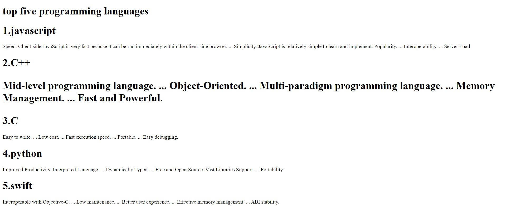

# Developing a Simple Webserver
## AIM:
To develop a simple webserver to display top five programming language.

## DESIGN STEPS:
### Step 1: 
HTML content creation
### Step 2:
Design of webserver workflow
### Step 3:
Implementation using Python code
### Step 4:
Serving the HTML pages.
### Step 5:
Testing the webserver

## PROGRAM:
```
from http.server import HTTPServer, BaseHTTPRequestHandler
content = """
<!DOCTYPE html>
<html>
<head>
<title>My webserver</title>
</head>
<body>
<h1>top five programming language</h1>

<h1>1.javascript</h1>
<p>JavaScript is the world's most popular programming language.

JavaScript is the programming language of the Web.

JavaScript is easy to learn.

This tutorial will teach you JavaScript from basic to advanced.</p>

<h1>2.c++</h1>
<p>C++ is a cross-platform language that can be used to create high-performance applications.

C++ was developed by Bjarne Stroustrup, as an extension to the C language.

C++ gives programmers a high level of control over system resources and memory.

The language was updated 3 major times in 2011, 2014, and 2017 to C++11, C++14, and C++17.</p>

<h1>3.python</h1>
<p>web development (server-side),
software development,
mathematics,
system scripting.</p>

<h1>4.kotllin</h1>
<p>Kotlin is a general-purpose programming language originally developed and unveiled as Project Kotlin by JetBrains in 2011.
The first version was officially released in 2016.
It is interoperable with Java and supports functional programming languages.</p>

<h1>5.swift</h1>
<p>A few years ago, Swift made the top 10 in the monthly TIOBE Index ranking of popular programming languages.
Apple developed Swift in 2014 for Linux and Mac applications.</p> 

</body>
</html>
"""
class myhandler(BaseHTTPRequestHandler):
    def do_GET(self):
        print("request received")
        self.send_response(200)
        self.send_header('content-type', 'text/html; charset=utf-8')
        self.end_headers()
        self.wfile.write(content.encode())
server_address = ('',8080)
httpd = HTTPServer(server_address,myhandler)
print("my webserver is running...")
httpd.serve_forever()
```
## OUTPUT:

## RESULT:
A simple webserver to display top five programming languages is developed.
